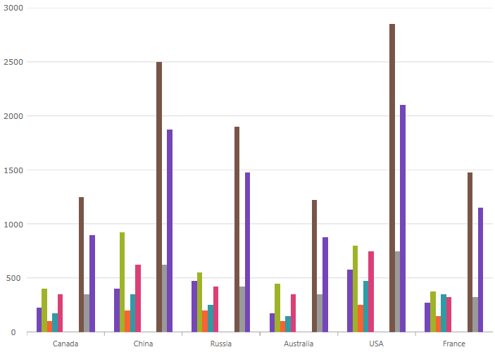
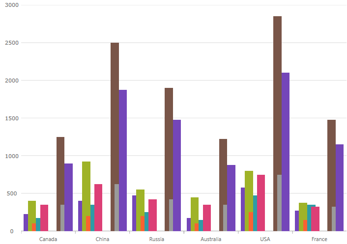

////
|metadata|
{
    "name": "categorychart-configuring-axis-gap-and-overlap",
    "controlName": ["{CategoryChartName}"],
    "tags": [],
    "buildFlags": []
}
|metadata|
////

= Configuring Axis Gap and Overlap on igCategoryChart

=== Purpose

This topic provides information on configuring axis gap and axis overlap in the {CategoryChartName}™ control.

=== Required background

The following topic is a prerequisite to understanding this topic:
link:categorychart-walkthrough.html[Adding Category Chart]

== Axis Gap

=== Overview

The Axis Gap feature of the {CategoryChartName} control allows setting the gap between series of the chart.

=== Property

Property name: link:{CategoryChartLink}.{CategoryChartBase}{ApiProp}XAxisGap.html[XAxisGap].

The property accepts a numeric float value between 0 and 1. The value represents a relative width of the gap out of the available number of pixels between series. 0 - no gap is rendered between series; 1 is the maximum available gap is rendered between series.

For the example, `xAxisGap` of 0.5 is a half of the available space is used to draw the gap.

=== Code Snippet

To initialize {CategoryChartName} with `xAxisGap` of `0.5` the following code can be used:

*In XAML:*

[source,xaml]
----
<ig:{CategoryChartName} x:Name="CategoryChart" 
                        ItemsSource="{Binding EnergySampleData}"
                        XAxisGap="0.5" 
                        ChartType="Column"
</ig:{CategoryChartName}>
----

== Axis Overlap

=== Overview

The Axis Overlap feature of the {CategoryChartName} control allows setting overlap of rendered categories.

=== Property

Property name: link:{CategoryChartLink}.{CategoryChartBase}{ApiProp}XAxisOverlap.html[XAxisOverlap].

The property accepts a numeric float value between -1 and 1. The value represents a relative overlap out of the available number of pixels dedicated to each series.

Negative value (up to -1): the categories are pushed away from each other producing a gap between themselves.

Positive value (up to 1): the categories are overlapping each other. Value of 1 directs the chart to render categories on top of each other.

For the example, `xAxisOverlap` of 0.5 is a half of the available space is used to draw categories overlapping each other.
: 
 

`xAxisOverlap` of -1 pushes categories from each other as far as possible.

=== Code Snippet

*In XAML:*

[source,xaml]
----
<ig:{CategoryChartName} x:Name="CategoryChart" 
                        ItemsSource="{Binding EnergySampleData}"
                        XAxisOverlap="0.5" 
                        ChartType="Column"
</ig:{CategoryChartName}>
----

[[RelatedContent]]
== Related Content

[options="header", cols="a,a"]
|====
|Topic|Purpose

| link:categorychart-walkthrough.html[Adding Category Chart]
|This article will get you up and running with the category chart control.

| link:categorychart-chart-types.html[Chart Types]
|This article describes the available chart types.