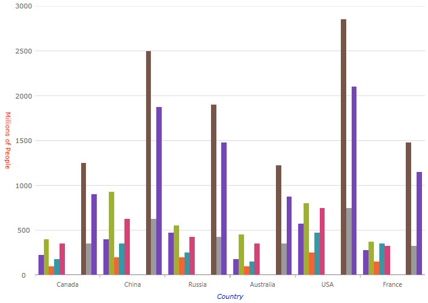

////
|metadata|
{
    "name": "categorychart-configuring-axis-titles",
    "controlName": ["{CategoryChartName}"],
    "tags": [],
    "buildFlags": []
}
|metadata|
////

= Axis Titles
The axis title feature of the {CategoryChartName} control allows you to add contextual information to the x and y axes of the chart.

=== In this topic

This topic contains the following sections:

* <<propertysettings,Property Settings>>
* <<codesnippet,Code Snippet>>
* <<RelatedContent,Related Content>>

[[propertysettings]]
== Property Settings
You can customize the look and feel of the category chart's x-axis and y-axis titles in many different ways such as applying different font styles, margins, and alignment. This can be achieved through the following properties:

[options="header", cols="a,a,a"]
|====
|Property Name|Property Type|Description

|link:{DataChartLink}.{CategoryChartName}{ApiProp}XAxisTitle.html[XAxisTitle], link:{DataChartLink}.{CategoryChartName}{ApiProp}YAxisTitle.html[YAxisTitle] 
|String
|Determines the text to be used for the x-axis and y-axis title

|link:{DataChartLink}.{CategoryChartName}{ApiProp}XAxisTitleAlignment.html[XAxisTitleAlignment], link:{DataChartLink}.{CategoryChartName}{ApiProp}YAxisTitleAlignment.html[YAxisTitleAlignment] 
|enumeration
|Determines the horizontal alignment of the x-axis and the vertical alignment of the y-axis 

|link:{DataChartLink}.{CategoryChartName}{ApiProp}XAxisTitleAngle.html[XAxisTitleAngle], link:{DataChartLink}.{CategoryChartName}{ApiProp}YAxisTitleAngle.html[YAxisTitleAngle] 
|Number
|Determines the angle rotation for the x-axis and y-axis titles

|link:{DataChartLink}.{CategoryChartName}{ApiProp}XAxisTitleAngle.html[XAxisTitleAngle], link:{DataChartLink}.{CategoryChartName}{ApiProp}YAxisTitleAngle.html[YAxisTitleAngle] 
|Number
|Determines the angle rotation for the x-axis and y-axis titles

|link:{DataChartLink}.{CategoryChartName}{ApiProp}XAxisTitleMargin.html[XAxisTitleMargin], link:{DataChartLink}.{CategoryChartName}{ApiProp}YAxisTitleMargin.html[YAxisTitleMargin] 
|Number
|Determines the margin to be applied to the x-axis or y-axis title

|link:{DataChartLink}.{CategoryChartName}{ApiProp}XAxisTitleForeground.html[XAxisTitleForeground],  link:{DataChartLink}.{CategoryChartName}{ApiProp}YAxisTitleForeground.html[YAxisTitleForeground] 
|String
|Determines the color for the x-axis or y-axis title

|link:{DataChartLink}.{CategoryChartName}{ApiProp}XAxisTitleFontStyle.html[XAxisTitleFontStyle], link:{DataChartLink}.{CategoryChartName}{ApiProp}YAxisTitleFontStyle.html[YAxisTitleFontStyle] 
|FontStyle
|Determines the font styles to be applied to the x-axis or y-axis title
|====

[[codesnippet]]
== Code Snippet
The following code example shows how to customize the titles on the x-axis and y-axis:

*In XAML:*

----
<ig:XamCategoryChart x:Name="chart1"  
                     Title="Weather Data"
                     Subtitle="(High, Average, Low)"
                     XAxisLabelFontSize="16"
                     XAxisLabelMargin="14"
                     XAxisLabel="{}{Date:MM/dd}"
                     XAxisLabelForeground="Red"
                     XAxisLabelFontWeight="Bold" />
----

[[RelatedContent]]
== Related Topics:

link:categorychart-binding-to-data.html[Binding to Data]

link:categorychart-walkthrough.html[Walkthrough]