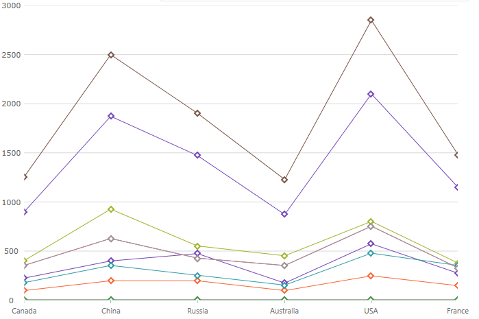

////
|metadata|
{
    "name": "categorychart-configuring-chart-markers",
    "controlName": ["{CategoryChartName}"],
    "tags": [],
    "buildFlags": []
}
|metadata|
////

= Configuring Chart Markers

Markers are visual elements that display the values of data points in the {CategoryChartName}™ control's plot area. Markers help your end-users immediately identify a data point's value even if the value falls between major or minor grid lines.
This section provides you with useful information about working with the {CategoryChartName} control's Markers.

=== In this topic

This topic contains the following sections:

* <<markerappearance,Marker Appearance>> 
* <<markertypes,Marker Types>>
* <<markerbrushesandoutlines,Marker Brushes and Outlines>>

The appearance of chart markers is managed through the marker properties of the {CategoryChartName} class.

[[markerappearance]]
== Marker Appearance

The following table lists all marker appearance properties.

[options="header", cols="a,a,a"]
|====
|Property Name|Property Type|Description

|link:{DataChartLink}.{CategoryChartName}{ApiProp}MarkerTypes.html[MarkerTypes]| MarkerType |Determines type of markers displayed by the all series in the chart
|link:{DataChartLink}.{CategoryChartName}{ApiProp}MarkerBrushes.html[MarkerBrushes]|Brush |Determines fill color of markers
|link:{DataChartLink}.{CategoryChartName}{ApiProp}MarkerOutlines.html[MarkerOutlines]|Brush|Determines outline color of markers
|====

[[markertypes]]
== Marker Types

[options="header", cols="a,a,a"]
|====
|Property Name|Property Type|Description

|`CircleMarker`|MarkerType|Displays the Circle marker type.
|`DiamondMarker`|MarkerType|Displays the Diamond marker type.
|`HexagonMarker`|MarkerType|Displays the Hexagon marker type.
|`HexagramMarker`|MarkerType|Displays the Hexagram marker type.
|`PentagramMarker`|MarkerType|Displays the Pentagram marker type.
|`PentagonMarker`|MarkerType|Displays the Pentagon marker type.
|`PyramidMarker`|MarkerType|Displays the Pyramid marker type.
|`SquareMarker`|MarkerType|Displays the Square marker type.
|`TetragramMarker`|MarkerType|Displays the Tetragram marker type.
|`TriangleMarker`|MarkerType|Displays the Triangle marker type.

|====

The code snippets below demonstrate how to change the marker type for the {CategoryChartName}.

*In XAML:*

----
<ig:XamCategoryChart MarkerTypes=”Circle Diamond Square” />
----

The following screenshot displays the {CategoryChartName} control using the Line chart type with Diamond markers.

[[markerbrushesandoutlines]]
== Marker Brush and Outline

The code snippets below demonstrate how to change the MarkerBrushes and MarkerOutlines for the {CategoryChartName}.

*In XAML:*

----
<ig:XamCategoryChart 
      MarkerBrushes=”White” 
      MarkerOutlines=”Red Orange Green”
      Brushes=”Red Orange Green”  >
</ig:XamCategoryChart>

----

The following screenshot displays the {CategoryChartName} control using the Line chart type with customized markers.

[options="header", cols="a,a"]
|====
|Topic|Purpose

| link:categorychart-data-binding.html[Data Binding]
|This topic describes in detail how to bind the control to data.

| link:categorychart-overview.html[Overview]
|This topic provides a conceptual overview of the category chart control.

|====