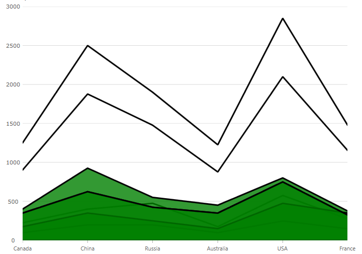

////
|metadata|
{
    "name": "categorychart-configuring-chart-types",
    "controlName": ["{CategoryChartName}"],
    "tags": [],
    "buildFlags": []
}
|metadata|
////

= Configuring Chart Types

== Setting chart type

As described in the link:categorychart-chart-types.html[Chart Types] topic the chart can render different types of chart with a simple change of a property.

To assign chart type during initialization:

*In XAML:*

[source,xaml]
----
<ig:{CategoryChartName} x:Name="CategoryChart" 
                        ItemsSource="{Binding EnergySampleData}"
                        ChartType="Spline"
</ig:{CategoryChartName}>
----

== Properties

To further customize the look of the chart there is a number of properties available that allows doing just that.

[options="header", cols="a,a,a,a"]
|====
|*Property Name*|*Property Type*|*Default Value*|*Description*

|link:{CategoryChartLink}.{CategoryChartBase}{ApiProp}brushes.html[Brushes] 
|object
|null
|Gets or sets the palette of brushes to use for coloring the chart series. The value provided should be an array of CSS color strings or JavaScript objects defining gradients. Optionally the first element can be a string reading "RGB" or "HSV" to specify the interpolation mode of the collection.
|link:{CategoryChartLink}.{CategoryChartBase}{ApiProp}negativebrushes.html[NegativeBrushes] 
|object
|null
|Gets or sets the palette used for coloring negative items of Waterfall chart type. The value provided should be an array of CSS color strings or JavaScript objects defining gradients. Optionally the first element can be a string reading "RGB" or "HSV" to specify the interpolation mode of the collection.
|link:{CategoryChartLink}.{CategoryChartBase}{ApiProp}outlines.html[Outlines]
|object
|null
|Gets or sets the palette of brushes to use for outlines on the chart series. The value provided should be an array of CSS color strings or JavaScript objects defining gradients. Optionally the first element can be a string reading "RGB" or "HSV" to specify the interpolation mode of the collection.
|link:{CategoryChartLink}.{CategoryChartBase}{ApiProp}resolution.html[Resolution]
|number
|1
|Gets or sets the rendering resolution for series in this chart. Where n = Resolution, for every n horizontal pixels, combine all items into a single datapoint.  When Resolution = 0, all datapoints will be rendered as graphical objects.  Charts with a higher resolution will have faster performance.
|link:{CategoryChartLink}.{CategoryChartBase}{ApiProp}thickness.html[Thickness]
|number
|1
|Gets or sets the thickness of the chart series. Depending on the ChartType, this can be the main brush used, or just the outline.
|link:{CategoryChartLink}.{CategoryChartBase}{ApiProp}xAxisGap.html[XAxisGap]
|number
|0
|Gets or sets the amount of space between adjacent categories for the X-axis. Gets or sets the gap is silently clamped to the range [0, inf] when used.
|link:{CategoryChartLink}.{CategoryChartBase}{ApiProp}xAxisOverlap.html[XAxisOverlap]
|number
|0
|Gets or sets the amount of overlap between adjacent categories for the X-axis. Gets or sets the overlap is silently clamped to the range [-1, 1] when used.
|link:{CategoryChartLink}.{CategoryChartBase}{ApiProp}XAxisInverted.html[XAxisInverted]
|bool
|null
|Gets or sets whether the direction of the X-axis is inverted, placing the first data items on the right side instead of left side.
|link:{CategoryChartLink}.{CategoryChartBase}{ApiProp}YAxisInverted.html[YAxisInverted]
|bool
|null
|Gets or sets whether the direction of the Y-axis is inverted, placing minimum numeric value at the top of the axis instead of bottom.
|====

== Example

The following example exercises some of the properties mentioned above.
To see more configuration options, follow the links at the bottom of this topic.

*In XAML:*

[source,xaml]
----
<ig:{CategoryChartName} DataContext="{StaticResource DataViewModel}" 
                        ItemsSource="{Binding EnergySampleData}"
                        ChartType="Area" Brushes="Blue, Green" 
                        NegativeBrushes="Red, Yellow" 
                        Outlines="black" Thickness="3"
</ig:{CategoryChartName}>
----

[[RelatedContent]]
== Related Content

[options="header", cols="a,a"]
|====
|Topic|Purpose

| link:categorychart-walkthrough.html[Adding Category Chart]
|This article will get you up and running with the category chart control.

| link:categorychart-chart-types.html[Chart Types]
|This article describes the available chart types.