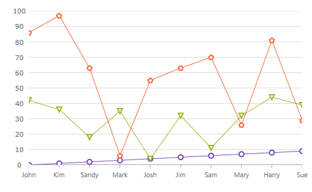

////
|metadata|
{
    "name": "categorychart-data-binding",
    "controlName": ["{CategoryChartName}"],
    "tags": ["Data Binding"],
    "guid": "8a5963d0-af62-4426-8aeb-547da883d52d",
    "buildFlags": ["SL","WPF","win-phone","XAMARIN","ANDROID","WINFORMS"],
    "createdOn": "2014-06-05T19:53:12.0748984Z"
}
|metadata|
////

= Data Binding

This topic demonstrates how to bind data to the link:{CategoryChartLink}.{CategoryChartName}.html[{CategoryChartName}]™ control. At the end of the topic, a complete code sample is provided.

The topic is organized as follows:

* <<Introduction,Introduction>>
* <<Preview,Preview>>
* <<Requirements,Requirements>>
* <<Overview,Overview>>
* <<Steps,Steps>>
* <<RelatedTopics,Related Topics>>

[[Introduction]]
== Introduction

The procedure below demonstrates how to bind the {CategoryChartName} control to a data collection.  pick:[xaml="You will define a data collection, add the Category Chart control to your application, and then bind the control’s"]   pick:[xaml=" link:{CategoryChartLink}.{CategoryChartBase}~ItemsSource.html[ItemsSource]"]   pick:[xaml="to an instance of the data collection."]

[[Preview]]
== Preview

ifdef::xaml[]
image::images/CategoryChart_DataBinding_01.png[]
endif::xaml[]

ifdef::win-forms[]

endif::win-forms[]

Figure 1: The {CategoryChartName} control as implemented by the sample code

[[Requirements]]
== Requirements

Required  pick:[xaml,win-forms="assembly references"] 

*  pick:[xaml="Add the following Infragistics assemblies to the *SampleApp* project:"]    pick:[win-forms="Add the following Infragistics assemblies:"] 

ifdef::xaml,win-forms[]
** {ApiPlatform}{PieChartAssembly}{ApiVersion}dll

endif::xaml,win-forms[]

ifdef::xaml,win-forms[]
** {ApiPlatform}DataVisualization{ApiVersion}dll

endif::xaml,win-forms[]

ifdef::win-forms[]
** {ApiPlatform}Win.Portable.Core{ApiVersion}dll

endif::win-forms[]

ifdef::xaml[]

*In XAML:*

----
xmlns:ig="http://schemas.infragistics.com/xaml"
xmlns:local="clr-namespace;SampleApp;assembly=SampleApp"
----

endif::xaml[]

ifdef::win-forms[]

*In C#:*

[source,csharp]
----
using Infragistics.Win.DataVisualization.UltraDataChart; 
using Infragistics.Win.DataVisualization.Shared; 
using Infragistics.Win.Portable.Core;
----

endif::win-forms[]

ifdef::win-forms[]

*In VB:*

[source,vb]
----
Imports Infragistics.Win.DataVisualization.UltraDataChart 
Import Infragistics.Win.DataVisualization.Shared 
Import Infragistics.Win.Portable.Core
----

endif::win-forms[]

[[Overview]]
== Overview

[start=1]
. Defining a Data Model
[start=2]
. Adding an Instance of the Pie Chart control
[start=3]
. (Optional) Verifying the result

[[Steps]]
== Steps

[start=1]
. *Define a Data Model* .

Create a class to model the data. The following code creates a DataItem class representing simple value-label pairs, as well as a Data class representing a collection of those pairs:

ifdef::xaml[]

*In C#:*

----
   public class ViewModel
    {
        private ObservableCollection<DataItem> m_Data;

        public ObservableCollection<DataItem> Data
        {
            get { return m_Data; }
            set { m_Data = value; }
        }   
        
        public ViewModel()
        {
            CreateData();
        }

        private string[] names = {
        "John",
        "Kim",
        "Sandy",
        "Mark",
        "Josh",
        "Jim",
        "Sam",
        "Mary",
        "Harry",
        "Sue",
        "Chris",
        "Joe",
        "Carl"
    };
        private void CreateData()
        {
            Random r = new Random();

            for (int j = 0; j <= 2; j++)
            {
                Data = new ObservableCollection<DataItem>();

                for (int i = 0; i <= 9; i++)
                {
                    Data.Add(new DataItem
                    {
                        ID = i,
                        Name = names[i],
                        Value1 = r.Next(1, 50),
                        Value2 = r.Next(1, 100)
                    });
                }               
            }
        }
    }

    public class DataItem
    {  
        public int ID
        {
            get { return m_ID; }
            set { m_ID = value; }
        }

        private int m_ID;
        public string Name
        {
            get { return m_Name; }
            set { m_Name = value; }
        }

        private string m_Name;
        public double Value1
        {
            get { return m_Value1; }
            set { m_Value1 = value; }
        }

        private double m_Value1;
        public double Value2
        {
            get { return m_Value2; }
            set { m_Value2 = value; }
        }

        private double m_Value2;
    }  

----

endif::xaml[]

ifdef::win-forms[]

*In C#:*

----
    public class ViewModel
    {
        private ObservableCollection<DataItem> m_Data;

        public ObservableCollection<DataItem> Data
        {
            get { return m_Data; }
            set { m_Data = value; }
        }   
        
        public ViewModel()
        {
            CreateData();
        }

        private string[] names = {
        "John",
        "Kim",
        "Sandy",
        "Mark",
        "Josh",
        "Jim",
        "Sam",
        "Mary",
        "Harry",
        "Sue",
        "Chris",
        "Joe",
        "Carl"
    };
        private void CreateData()
        {
            Random r = new Random();

            for (int j = 0; j <= 2; j++)
            {
                Data = new ObservableCollection<DataItem>();

                for (int i = 0; i <= 9; i++)
                {
                    Data.Add(new DataItem
                    {
                        ID = i,
                        Name = names[i],
                        Value1 = r.Next(1, 50),
                        Value2 = r.Next(1, 100)
                    });
                }               
            }
        }
    }

    public class DataItem
    {  
        public int ID
        {
            get { return m_ID; }
            set { m_ID = value; }
        }

        private int m_ID;
        public string Name
        {
            get { return m_Name; }
            set { m_Name = value; }
        }

        private string m_Name;
        public double Value1
        {
            get { return m_Value1; }
            set { m_Value1 = value; }
        }

        private double m_Value1;
        public double Value2
        {
            get { return m_Value2; }
            set { m_Value2 = value; }
        }

        private double m_Value2;
    }  

----

endif::win-forms[]

ifdef::xaml[]

*In Visual Basic:*

----
Public Class ViewModel
    Public Property Data() As ObservableCollection(Of DataItem)
        Get
            Return m_Data
        End Get
        Set(value As ObservableCollection(Of DataItem))
            m_Data = Value
        End Set
    End Property
    Private m_Data As ObservableCollection(Of DataItem)

    Public Sub New()
        CreateData()
    End Sub

    Private names As String() = {"John", "Kim", "Sandy", "Mark", "Josh", "Jim", _
        "Sam", "Mary", "Harry", "Sue", "Chris", "Joe", _
        "Carl"}
    Private Sub CreateData()
        Dim r As New Random()

        For j As Integer = 0 To 2
            Data = New ObservableCollection(Of DataItem)()
            For i As Integer = 0 To 9

                Data.Add(New DataItem() With {
                     .ID = i,
                     .Name = names(i),
                     .Value1 = r.[Next](1, 50),
                     .Value2 = r.[Next](1, 100)
                })
            Next
        Next
    End Sub
End Class

Public Class DataItem

    Public Property ID() As Integer
        Get
            Return m_ID
        End Get
        Set(value As Integer)
            m_ID = value
        End Set
    End Property
    Private m_ID As Integer

    Public Property Name() As String
        Get
            Return m_Name
        End Get
        Set(value As String)
            m_Name = value
        End Set
    End Property
    Private m_Name As String

    Public Property Value1() As Double
        Get
            Return m_Value1
        End Get
        Set(value As Double)
            m_Value1 = value
        End Set
    End Property
    Private m_Value1 As Double

    Public Property Value2() As Double
        Get
            Return m_Value2
        End Get
        Set(value As Double)
            m_Value2 = value
        End Set
    End Property
    Private m_Value2 As Double

End Class

----

endif::xaml[]

ifdef::win-forms[]

*In Visual Basic:*

----
Public Class DataItem    
   Public Property Label() As String 
      Get          
         Return _Label        
       End Get     
       Set            
          _Label = Value          
       End Set    
    End Property  
    Private _Label As String    
    Public Property Value() As Double 
       Get    
          Return _Value         
       End Get        
       Set    
          _Value = Value         
       End Set      
    End Property    
    Private _Value As Double   
End Class    
Public Class Data    
   Inherits ObservableCollection(Of DataItem)       
   Public Sub New()   
      Add(New DataItem() With { .Label = "Item 1", .Value = 5 })         
      Add(New DataItem() With { .Label = "Item 2", .Value = 6 })           
      Add(New DataItem() With { .Label = "Item 3", .Value = 3 })           
      Add(New DataItem() With { .Label = "Item 4", .Value = 7 })           
      Add(New DataItem() With { .Label = "Item 5", .Value = 5 })           
   End Sub  
 End Class
----

endif::win-forms[]

[start=2]
. *Add an instance of the {CategoryChartName} Control* .

To the  pick:[xaml="layout root"]  pick:[win-forms="form"] , add an instance of the data collection, a legend instance, and an instance of the Category Chart:

ifdef::xaml[]

*In XAML:*

----
    <Grid x:Name="LayoutRoot" >
        <Grid.Resources>
            <local:Data x:Key="data" />
        </Grid.Resources>
        <ig:ItemLegend x:Name="Legend"
                       Grid.Row="1"
                       VerticalAlignment="Top"
                       HorizontalAlignment="Right"  />
        <ig:{PieChartName} Name="pieChart"
                       Grid.Row="2"
                       ItemsSource="{StaticResource data}"
                       LabelMemberPath="Label"
                       ValueMemberPath="Value"
                       Legend="{Binding ElementName=Legend}"/>
    </Grid>
----

endif::xaml[]

ifdef::win-forms[]

*In C#:*

[source,csharp]
----
UltraCategoryChart categoryChart = new UltraCategoryChart();
this.Controls.Add(categoryChart);
categoryChart.Dock = DockStyle.Fill;
categoryChart.LabelMemberPath = "Label";
categoryChart.ValueMemberPath = "Value";
categoryChart.DataSource = new Data(); 
UltraItemLegend legend = new UltraItemLegend();
this.Controls.Add(legend);
legend.Dock = DockStyle.Right;
legend.Height = 500;
categoryChart.Legend = legend;
legend.BringToFront();
----

endif::win-forms[]

ifdef::win-forms[]

*In VB:*

[source,vb]
----
Dim categoryChart As New UltraCategoryChart ()
Me.Controls.Add(categoryChart)
categoryChart.Dock = DockStyle.Fill
categoryChart.LabelMemberPath = "Label"
categoryChart.ValueMemberPath = "Value"
categoryChart.DataSource = New Data ()  
Dim legend As New UltraItemLegend()
legend.Dock = DockStyle.Right
legend.Height = 500
categoryChart.Legend = legend
legend.BringToFront()
----

endif::win-forms[]

[start=3]
. *(Optional) Verify the Result* .

Run your application to verify the result. If you have successfully bound the Pie Chart control to the data collection, the resulting chart will look like the one shown in Figure 1, above.