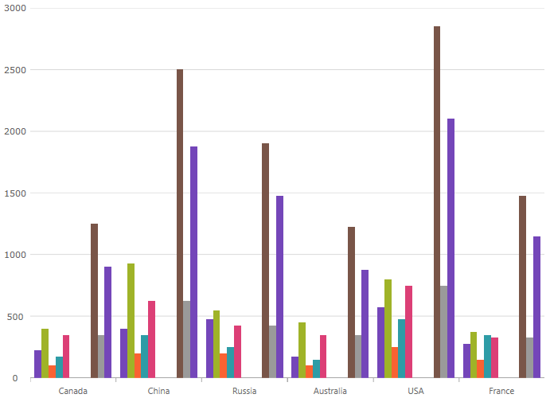

////
|metadata|
{
    "name": "categorychart-walkthrough",
    "controlName": ["{CategoryChartName}"],
    "tags": [],
    "buildFlags": []
}
|metadata|
////

= Adding {CategoryChartName}

=== Purpose

This topic explains using a code example how to add the  _{CategoryChartName}_™ control to {PlatformName} applications.

=== In this topic

This topic contains the following sections:

* <<Adding,Adding  _{CategoryChartName}_   to the {PlatformName} application>>

** <<Introduction,Introduction>>
** <<Preview,Preview>>
** <<Prerequisites,Requirements>>
** <<Overview,Overview>>
** <<Steps,Steps>>

* <<RelatedContent,Related Content>>

[[Adding]]
== Adding  _{CategoryChartName}_   to the {PlatformName} application

[[Introduction]]

=== Introduction

The following procedure demonstrates adding the  _{CategoryChartName}_   to {PlatformName} applications.

[[Preview]]

=== Preview

The following is a screenshot of the  _{CategoryChartName}_  .

[[Prerequisites]]

=== Requirements

Following are the general requirements for adding the  _{CategoryChartName}_   control.

[options="header", cols="a,a"]

Add pick:[xaml,win-forms="assembly"] pick:[android="Jar"] references

[start=1] 

. Add the following Infragistics pick:[xaml="assemblies"] pick:[android="jars"] to your SampleApp project: 

ifdef::xaml,win-forms[] 

** {ApiPlatform}{PieChartAssembly}{ApiVersion}.dll 

** {ApiPlatform}DataVisualization{ApiVersion}.dll 

** {ApiPlatform}v{ProductVersion}.dll 

endif::xaml,win-forms[] 

ifdef::android[] 

** Infragistics.Gauge jar 

** DV.Shared jar 

** Infragistics.Core.jar 

** Infragistics.UI.jar 

endif::android[] 

ifdef::win-forms[] 

** {ApiPlatform}.Win.Portable{ApiVersion}.dll 

endif::win-forms[] 

ifdef::xamarin[] 

[start=2] 

. Add the following Infragistics assemblies to the *SampleApp.Android* project: 

** {ApiPlatform}Controls.Gauges.{ApiVersion}Android.dll 

** {ApiPlatform}{ApiVersion}Android.dll 

** InfragisticsAndroidBindings.dll 

[start=3] 

. Add Infragistics Unified (64-bit) or Classic (32-bit) assemblies to the *SampleApp.iOS* project: 

** {ApiPlatform}Controls.Charts.{ApiVersion}iOS.dll 

** {ApiPlatform}{ApiVersion}iOS.dll 

** IG.Unified.dll 

** IGChart.Unified.dll 

or 

** {ApiPlatform}Controls.Gauges.{ApiVersion}iOS.Classic.dll 

** {ApiPlatform}{ApiVersion}iOS.Classic.dll 

** IG.Classic.dll 

** IGChart.Classic.dll 

endif::xamarin[] 

ifdef::wpf[] 

*In XAML:*

---- 
xmlns:ig="http://schemas.infragistics.com/xaml" 
---- 

endif::wpf[] 

ifdef::xamarin[] 

*In XAML:*

---- 
xmlns:ig="clr-namespace:Infragistics.XF.Controls;assembly={ApiPlatform}Controls.Charts"
---- 

endif::xamarin[] 

ifdef::win-universal[] 

*In XAML:*

---- 
xmlns:ig="using:Infragistics.Controls.Charts"
---- 

endif::win-universal[] 

ifdef::xaml,win-forms[] 

*In C#:*

[source,csharp]
---- 
using {CategoryChartNamespace}; 
---- 

*In Visual Basic:*

[source,vb]
---- 
Imports {CategoryChartNamespace} 
---- 

ifdef::android[] 

*In Java:*

[source,js]
---- 
import com.infragistics.controls.CategoryChartView; 
---- 

endif::android[] 

[[Overview]]

=== Overview

Following is a conceptual overview of the process:

*1. Adding the {CategoryChartName} control to {PlatformName} applications*

*2. Verifying the results*

[[Steps]]

=== Steps

The following procedure takes you through the steps necessary for adding the  _{CategoryChartName}_  control to a page.

=== 1. Add the {CategoryChartName} control to the page.

The following code demonstrates adding the  _{CategoryChartName}_  control with the minimum code and property settings required for display:

ifdef::xaml[]

*In XAML:*

[source,xaml]
----
<Grid x:Name=”LayoutRoot”>
 <ig:{CategoryChartName} ItemsSource="{Binding DataCollection}" />
</Grid>
----

endif::xaml[]

ifdef::xaml,win-forms[]
*In Visual Basic:*

----
Dim categoryChart As New {CategoryChartName}()
categoryChart.ItemsSource = data
Me.LayoutRoot.Children.Add(categoryChart)  
----

*In C#:*

----
var categoryChart = new {CategoryChartName}();
categoryChart.ItemsSource = data;
this.LayoutRoot.Children.Add(categoryChart);  
----
endif::xaml,win-forms[]

ifdef::android[]

*In Java:*

[source,js]
----
View rootView = inflater.inflate(R.layout.fragment_main, container, false);
CategoryChartView categoryChart = new CategoryChartView(rootView.getContext());
return (categoryChart);
----

endif::android[]

=== 2. Verify the results.

Build and run your project to verify the result. If you have implemented the steps correctly, the displayed {CategoryChartName} should look like the one in the Preview section above.

[[_Ref348111483]]

[[RelatedContent]]

== Related Content

=== Topics

The following topics provide additional information related to this topic:

[options="header", cols="a,a"]
|====
|Topic|Purpose

| link:categorychart-data-binding.html[Data Binding]
|This topic describes in detail how to bind the control to data.

| link:categorychart-overview.html[Overview]
|This topic provides a conceptual overview of the category chart control.

|====